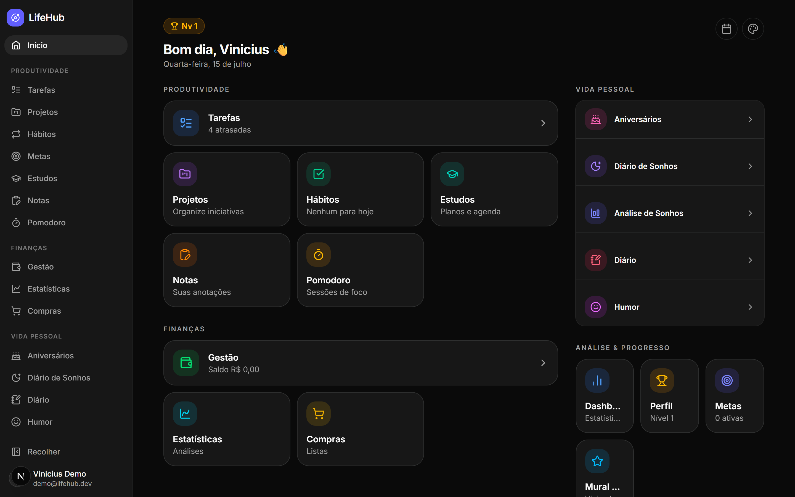
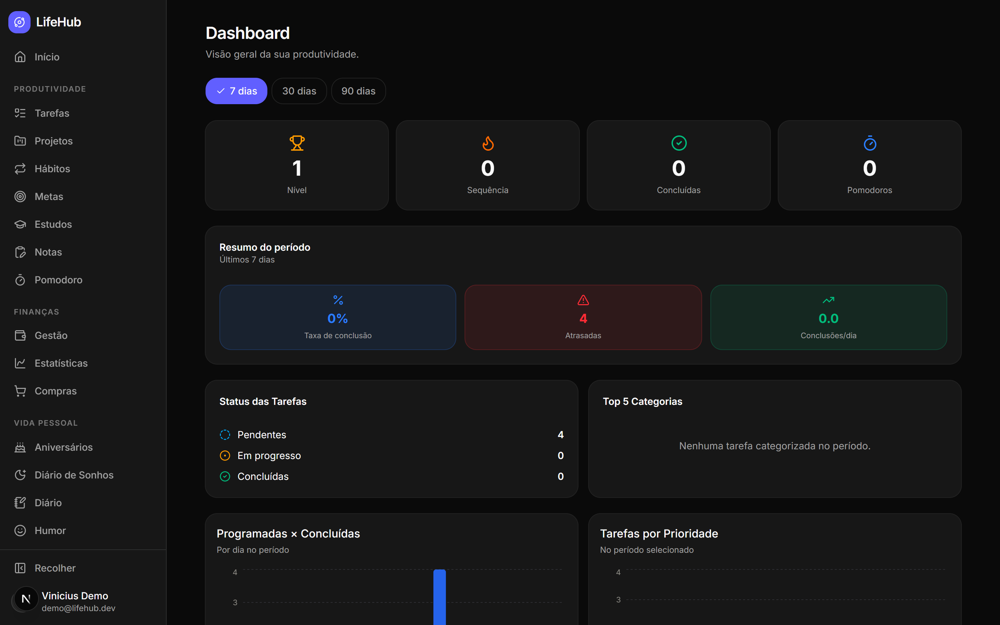
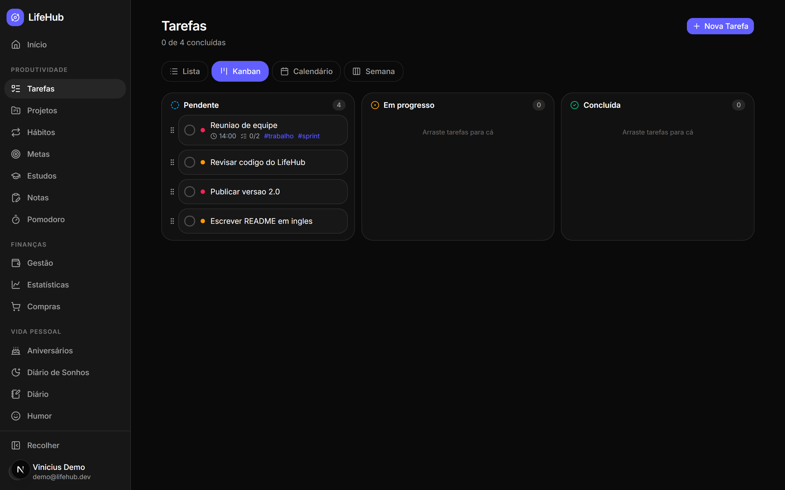
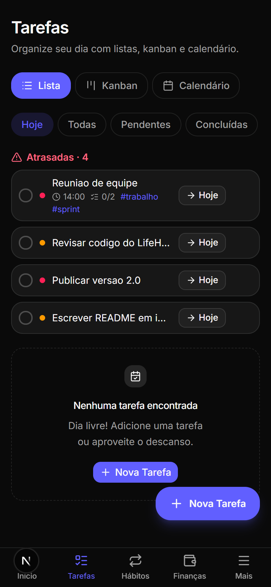
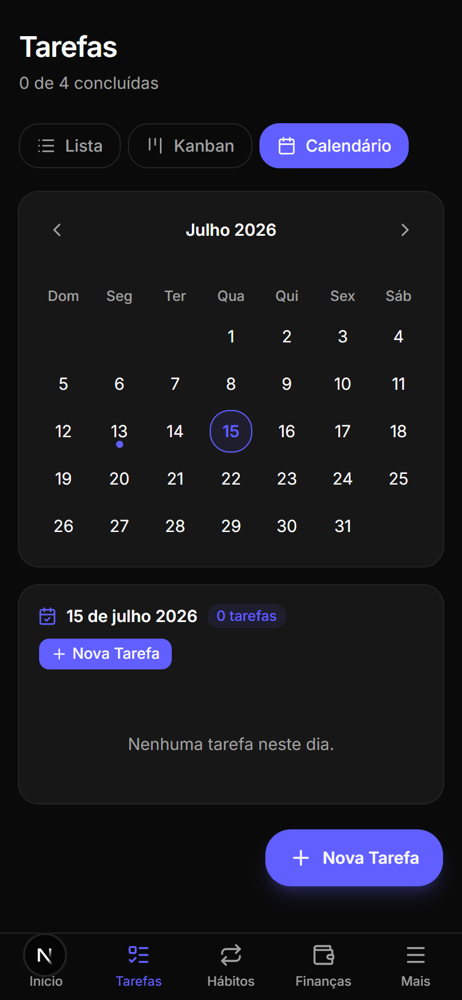
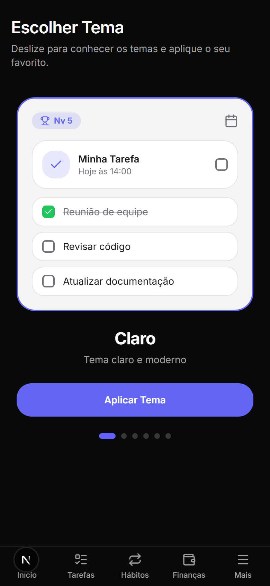
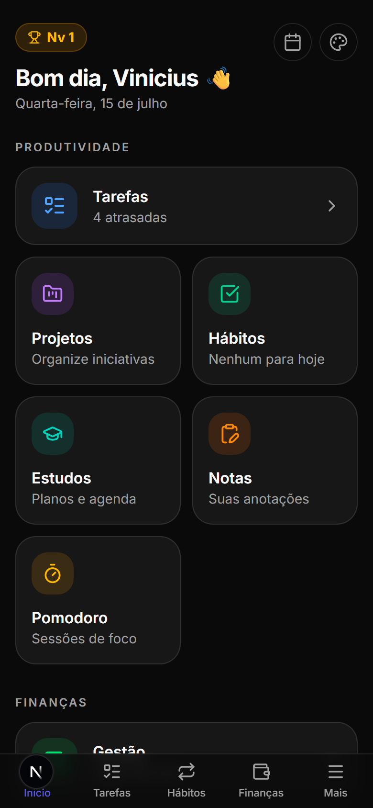
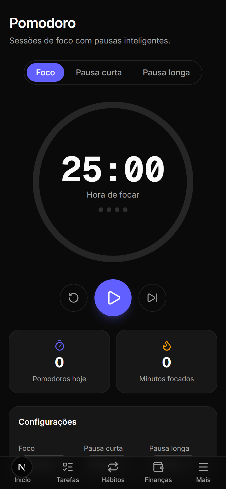
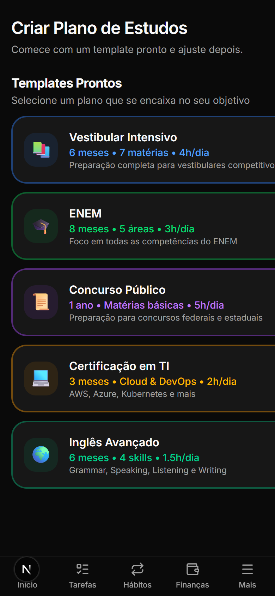
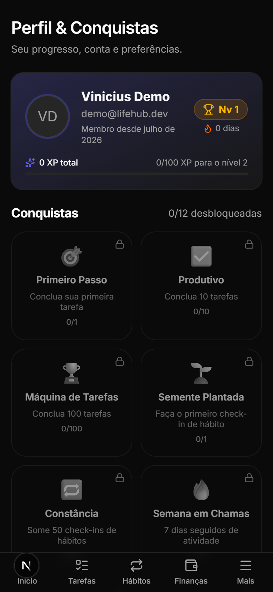

# LifeHub

**Your personal Life OS** — tasks, projects, habits, goals, study plans, pomodoro, finances, shopping lists, birthdays, journals, mood and dream tracking, gamification and 6 color themes. Mobile-first PWA, dark mode by default, UI in Brazilian Portuguese.

**Live demo:** [lifehub-nine-iota.vercel.app](https://lifehub-nine-iota.vercel.app)

## Screenshots

### Home hub & productivity dashboard

| Home hub (desktop)                                                                                 | Productivity dashboard                                                                              |
| -------------------------------------------------------------------------------------------------- | --------------------------------------------------------------------------------------------------- |
|  |  |

### Tasks — list, kanban and calendar

| Kanban (desktop)                                                              |
| ----------------------------------------------------------------------------- |
|  |

| List (mobile)                                                                           | Calendar (mobile)                                                            | Themes gallery                                                                 |
| --------------------------------------------------------------------------------------- | ---------------------------------------------------------------------------- | ------------------------------------------------------------------------------ |
|  |  |  |

### Mobile experience

| Home hub                                                 | Pomodoro                                                                       | Study plans                                                  | Profile & achievements                                                                         |
| -------------------------------------------------------- | ------------------------------------------------------------------------------ | ------------------------------------------------------------ | ---------------------------------------------------------------------------------------------- |
|  |  |  |  |

## Features

**Productivity**

- **Tasks 2.0** — list / kanban / calendar / week views, subtasks, tags, categories, scheduled time, reminders, recurring tasks, priorities, drag & drop
- **Projects** — color-coded projects with deadlines and task progress
- **Habits** — flexible frequencies, streaks, 365-day heatmap
- **Goals** — milestones, numeric/manual progress, life areas
- **Study plans** — ready-made templates (Vestibular, ENEM, civil service, IT certification, English), weekly agenda per subject, session logging
- **Notes** — Markdown editor with toolbar and GFM preview, colored categories, pinning, search
- **Pomodoro** — persistent timer that survives navigation, configurable focus/break cycles, task linking, daily stats

**Finances**

- Monthly management with categories, budgets and recurring transactions
- Dedicated statistics page (12-month flow, category breakdown, month-over-month variation, top expenses)
- Shopping lists with quantities, unit prices and purchased totals

**Personal life**

- Birthdays with relationship tags and days-until countdown
- Daily mood check-in with streaks and distribution analysis
- Journal with optional mood per entry
- Dream journal (lucid dreams, nightmares, clarity rating) with analysis
- Vision board ("Mural dos Sonhos") linked to goals

**Platform**

- **Gamification** — XP derived from real activity, levels, activity streak, 12 achievements
- **6 color themes** (Light, Dark, Blue, Pink, Red, Purple) with live preview carousel
- **Global search** across tasks and notes
- **Backup & restore** — full JSON export/import, idempotent
- **PWA** — installable, app shortcuts, offline shell
- **REST API v1** — every module exposed under `/api/v1` ([docs](./docs/api.md))

## Stack

| Layer       | Technology                                                    |
| ----------- | ------------------------------------------------------------- |
| Framework   | Next.js (App Router) + TypeScript strict                      |
| UI          | Tailwind CSS v4 + shadcn/ui + lucide-react                    |
| Database    | Neon Postgres (serverless)                                    |
| ORM         | Drizzle ORM + drizzle-kit (versioned migrations)              |
| Auth        | Better Auth (email/password + Google OAuth, httpOnly cookies) |
| Validation  | Zod (schemas shared between client and server)                |
| Client data | TanStack Query v5 (only where there is interactivity)         |
| Charts      | Recharts (palette validated for light/dark and CVD)           |
| Dates       | date-fns (pt-BR locale)                                       |
| Deploy      | Vercel                                                        |

## Architecture

```
src/
├── app/                # Routes (App Router) — thin layer
│   ├── (auth)/         # login, signup, password recovery
│   ├── (app)/          # protected routes (hub, tasks, habits…)
│   └── api/
│       ├── auth/[...all]/  # Better Auth handler
│       └── v1/             # REST API (mobile-ready)
├── server/
│   ├── db/             # Drizzle schema, Neon client, migrations
│   ├── services/       # ALL business logic (pure, testable)
│   └── actions/        # Server Actions (Zod → session → service → revalidate)
├── shared/             # Zod schemas, shared types and constants
├── components/         # ui/ (shadcn) and features/ (per module)
├── hooks/
└── lib/                # utils, auth client, formatting
```

**Golden rules:** every business rule lives in `src/server/services` as pure functions scoped by `userId`, exposed twice — through Server Actions (web) and through the versioned REST API (`/api/v1`, mobile-ready). Services never import React/Next. Money is always integer cents; dates are `YYYY-MM-DD` strings; every input is validated with Zod on the server; recurring records are generated idempotently at read time (the Neon HTTP driver has no transactions).

## Running locally

Prerequisites: Node 20+, [pnpm](https://pnpm.io) and a free [Neon](https://neon.tech) account.

1. **Clone and install**

   ```bash
   git clone https://github.com/ViniciusBenevides/lifehub.git
   cd lifehub
   pnpm install
   ```

2. **Configure the environment**

   ```bash
   cp .env.example .env.local
   ```

   - `DATABASE_URL`: create a project at [Neon](https://console.neon.tech) and copy the pooled connection string.
   - `BETTER_AUTH_SECRET`: generate with `npx @better-auth/cli secret` (or `openssl rand -base64 32`).
   - `GOOGLE_CLIENT_ID`/`GOOGLE_CLIENT_SECRET`: optional — without them the Google login button stays hidden.

3. **Create the tables**

   ```bash
   pnpm db:migrate
   ```

4. **Run the app**

   ```bash
   pnpm dev
   ```

   Open http://localhost:3000, create your account and you're set — default life areas and finance categories are seeded automatically.

## Scripts

| Script                      | What it does                                 |
| --------------------------- | -------------------------------------------- |
| `pnpm dev`                  | Development server                           |
| `pnpm build` / `pnpm start` | Production build and server                  |
| `pnpm lint` / `pnpm format` | ESLint / Prettier                            |
| `pnpm test`                 | Unit tests (Vitest)                          |
| `pnpm db:generate`          | Generate a migration from the Drizzle schema |
| `pnpm db:migrate`           | Apply migrations to the database             |
| `pnpm db:studio`            | Open Drizzle Studio                          |

## PWA

LifeHub is installable on mobile (own manifest + service worker): open the site in your phone's browser and use "Add to Home Screen". The REST API at [`/api/v1`](./docs/api.md) is the same one a future mobile app (Expo) will consume.

## Deploy (Vercel)

1. Import the repository at [vercel.com/new](https://vercel.com/new).
2. Add the environment variables from `.env.example` (use the deployment URL in `BETTER_AUTH_URL`).
3. Every branch automatically gets a preview deployment.

## Docs

- [docs/api.md](./docs/api.md) — REST API v1 reference
- [docs/decisions.md](./docs/decisions.md) — architecture decisions
- [PLAN.md](./PLAN.md) — build phases
